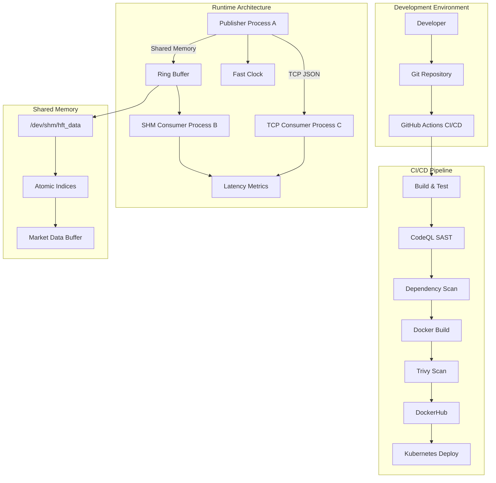

# Design Document

## Overview

The HFT Market Data Publishing System is a comprehensive educational platform that demonstrates both high-performance C++ development and modern DevOps practices. The system consists of three main processes: a Publisher that generates and distributes market data, a TCP Consumer that receives data over network connections, and a Shared Memory Consumer that receives data through ultra-low latency shared memory channels.

The system is designed with microsecond-level latency requirements in mind, utilizing lock-free data structures, memory-mapped shared memory, and performance optimizations like CPU affinity and cache-line alignment. Additionally, the project incorporates production-grade DevOps practices including automated CI/CD pipelines, security scanning, containerization, and Kubernetes deployment.

## Architecture



## Components and Interfaces

### Core HFT Components

#### MarketData Structure
```cpp
struct alignas(64) MarketData {
    char instrument[16];    // Fixed-size for cache efficiency
    double bid;
    double ask;
    int64_t timestamp_ns;   // Nanosecond precision
    char padding[24];       // Ensure 64-byte alignment
};
```

#### Publisher (Process A)
- **Responsibilities**: Generate market data, distribute via TCP and shared memory
- **Interfaces**:
  - TCP Server: Boost.Asio acceptor on 127.0.0.1:9000
  - Shared Memory Writer: POSIX shm_open/mmap interface
  - Fast Clock: Background thread for timestamp generation
- **Performance Features**:
  - TCP_NODELAY for immediate packet transmission
  - CPU affinity binding to specific cores
  - Memory pool allocation to avoid heap fragmentation

#### TCP Consumer (Process C)
- **Responsibilities**: Connect to publisher, parse JSON messages, log with latency
- **Interfaces**:
  - TCP Client: Boost.Asio socket connection
  - JSON Parser: nlohmann/json for message deserialization
  - Logger: fmt library for structured output
- **Error Handling**: Graceful reconnection on connection failures

#### Shared Memory Consumer (Process B)
- **Responsibilities**: Read from ring buffer, calculate ultra-low latency metrics
- **Interfaces**:
  - Shared Memory Reader: Read-only mmap attachment
  - Ring Buffer Consumer: Lock-free atomic operations
  - Metrics Calculator: Timestamp comparison for latency measurement

### Lock-Free Ring Buffer Design

```cpp
struct alignas(64) RingBuffer {
    alignas(64) std::atomic<size_t> write_idx;
    alignas(64) std::atomic<size_t> read_idx;
    static constexpr size_t BUFFER_SIZE = 1024;
    MarketData buffer[BUFFER_SIZE];
};
```

**Key Design Decisions**:
- **64-byte alignment**: Prevents false sharing between CPU cache lines
- **Acquire-Release semantics**: Ensures proper memory ordering without full barriers
- **Single Producer Single Consumer**: Optimized for the specific use case
- **Power-of-2 buffer size**: Enables efficient modulo operations using bitwise AND

#### Memory Ordering Strategy
- **Producer**: Uses `memory_order_release` on write_idx to ensure all data writes are visible
- **Consumer**: Uses `memory_order_acquire` on write_idx to see producer's writes
- **Index updates**: Atomic operations prevent race conditions without locks

### Shared Memory Management

```cpp
class SharedMemoryManager {
    int shm_fd;
    void* mapped_addr;
    size_t size;
    
public:
    // RAII lifecycle management
    SharedMemoryManager(const char* name, size_t size, bool create);
    ~SharedMemoryManager();
    
    // Memory mapping interface
    void* get_address() const { return mapped_addr; }
    bool is_valid() const { return mapped_addr != MAP_FAILED; }
};
```

**Implementation Details**:
- **Named shared memory**: Uses `/hft_market_data` identifier
- **POSIX compliance**: shm_open, ftruncate, mmap system calls
- **Resource cleanup**: Automatic shm_unlink on publisher termination
- **Permission model**: 0666 for multi-user access in development

### Fast Clock Implementation

```cpp
class FastClock {
    std::atomic<int64_t> cached_time_ns;
    std::thread update_thread;
    std::atomic<bool> running;
    
    void update_loop() {
        while (running.load()) {
            auto now = std::chrono::high_resolution_clock::now();
            cached_time_ns.store(now.time_since_epoch().count());
            std::this_thread::sleep_for(std::chrono::milliseconds(200));
        }
    }
    
public:
    int64_t now() const { return cached_time_ns.load(); }
};
```

**Performance Rationale**:
- **Syscall avoidance**: Hot path reads atomic variable instead of calling gettimeofday()
- **200ms update frequency**: Balances accuracy with CPU overhead
- **Atomic storage**: Thread-safe access without locks
- **Background thread**: Decouples time updates from critical path

## Data Models

### Market Data Flow
1. **Generation**: Publisher creates MarketData with random bid/ask prices
2. **Timestamping**: Fast clock provides nanosecond timestamps
3. **Distribution**: Parallel transmission via TCP (JSON) and shared memory (binary)
4. **Consumption**: Consumers calculate latency and log structured output

### Message Formats

#### TCP JSON Format
```json
{
    "instrument": "AAPL",
    "bid": 150.25,
    "ask": 150.27,
    "timestamp_ns": 1640995200000000000
}
```

#### Shared Memory Binary Format
- Direct memory copy of MarketData struct
- No serialization overhead
- Cache-aligned for optimal memory access patterns

### DevOps Data Models

#### CI/CD Pipeline Stages
```yaml
stages:
  - checkout: "Source code retrieval"
  - setup: "C++ build environment preparation"
  - lint: "Static analysis and coding standards"
  - sast: "CodeQL security analysis"
  - sca: "Dependency vulnerability scanning"
  - test: "Unit test execution and coverage"
  - build: "CMake compilation and linking"
  - docker: "Container image creation"
  - scan: "Trivy vulnerability scanning"
  - test_container: "Runtime validation"
  - publish: "DockerHub registry push"
  - deploy: "Kubernetes deployment"
```

#### Security Scan Results
- **SAST findings**: Code-level vulnerabilities (OWASP Top 10)
- **SCA findings**: Dependency vulnerabilities (CVE database)
- **Container findings**: OS and library vulnerabilities
- **Quality gates**: Fail pipeline on HIGH/CRITICAL findings

## Correctness Properties

*A property is a characteristic or behavior that should hold true across all valid executions of a system—essentially, a formal statement about what the system should do. Properties serve as the bridge between human-readable specifications and machine-verifiable correctness guarantees.*

Before defining the correctness properties, I need to analyze the acceptance criteria from the requirements to determine which ones are testable as properties.

### Property Reflection

After analyzing the acceptance criteria, I identified several properties that can be consolidated to eliminate redundancy:

- Properties 9.2 and 9.3 (latency calculation for TCP and SHM consumers) can be combined into a single comprehensive latency calculation property
- Properties 4.4 and 4.5 (buffer overflow/underflow detection) can be combined into a comprehensive buffer state management property
- Properties 1.1 and 1.4 (market data structure and timestamp embedding) overlap and can be consolidated

### Correctness Properties

Property 1: Market data structure completeness
*For any* generated MarketData object, it should contain a non-empty instrument name, valid bid and ask prices, and a nanosecond-precision timestamp
**Validates: Requirements 1.1, 1.4**

Property 2: Market data generation volume and variety
*For any* publisher execution, it should generate at least 1000 different quote messages with sufficient variety in instrument names and prices
**Validates: Requirements 1.2**

Property 3: Fixed-size instrument name compliance
*For any* generated MarketData object, the instrument name should fit within the fixed 16-character array without causing heap allocation
**Validates: Requirements 1.3**

Property 4: TCP connection handling
*For any* TCP client connection attempt, the publisher should accept the connection and begin streaming data without errors
**Validates: Requirements 2.2**

Property 5: JSON serialization correctness
*For any* MarketData object transmitted over TCP, it should be serialized to valid JSON format containing all required fields (instrument, bid, ask, timestamp_ns)
**Validates: Requirements 2.3**

Property 6: TCP disconnection resilience
*For any* TCP client disconnection event, the publisher should handle it gracefully without crashing or affecting other connections
**Validates: Requirements 2.4**

Property 7: JSON parsing completeness
*For any* valid JSON message received by the TCP consumer, it should be parsed correctly and all fields should be accessible
**Validates: Requirements 3.2**

Property 8: TCP stream boundary handling
*For any* sequence of partial TCP reads, the consumer should correctly reconstruct complete JSON messages without data loss or corruption
**Validates: Requirements 3.3**

Property 9: Lock-free ring buffer correctness
*For any* sequence of producer writes and consumer reads on the ring buffer, data should be transmitted correctly without race conditions or data corruption
**Validates: Requirements 4.1, 4.2**

Property 10: Memory alignment verification
*For any* critical data structure (RingBuffer, MarketData), it should be aligned to 64-byte boundaries to prevent false sharing
**Validates: Requirements 4.3**

Property 11: Ring buffer state management
*For any* ring buffer state (full or empty), the appropriate condition should be correctly detected and reported to the respective producer or consumer
**Validates: Requirements 4.4, 4.5**

Property 12: Shared memory consumer polling
*For any* new message written to the ring buffer, the SHM consumer should detect it through spin-wait polling within a reasonable time frame
**Validates: Requirements 6.2**

Property 13: Fast clock performance and precision
*For any* timestamp request in the hot path, the Fast_Clock should provide nanosecond-precision timestamps without making syscalls
**Validates: Requirements 7.1**

Property 14: Timestamp embedding consistency
*For any* market data message (TCP or shared memory), it should contain a valid send timestamp that can be used for latency calculation
**Validates: Requirements 9.1**

Property 15: Latency calculation accuracy
*For any* received message (TCP or SHM), the consumer should calculate latency as the difference between receive time and message timestamp, with results being positive and reasonable
**Validates: Requirements 9.2, 9.3**

## Error Handling

### HFT System Error Handling

#### Network Errors
- **TCP Connection Failures**: Implement exponential backoff retry mechanism
- **Socket Errors**: Graceful degradation with error logging and connection cleanup
- **JSON Parsing Errors**: Skip malformed messages and continue processing

#### Shared Memory Errors
- **shm_open Failures**: Fallback to alternative IPC mechanisms or graceful shutdown
- **mmap Failures**: Proper error reporting and resource cleanup
- **Ring Buffer Overflow**: Implement overflow detection with optional message dropping

#### Performance Degradation
- **High Latency Detection**: Alert mechanisms when latency exceeds thresholds
- **CPU Affinity Failures**: Continue operation with warning logs
- **Memory Allocation Failures**: Use pre-allocated memory pools where possible

### DevOps Pipeline Error Handling

#### Build Failures
- **Compilation Errors**: Fail fast with detailed error reporting
- **Test Failures**: Block deployment and provide test result artifacts
- **Dependency Resolution**: Retry with exponential backoff, fallback to cached versions

#### Security Scan Failures
- **SAST Findings**: Block deployment on HIGH/CRITICAL vulnerabilities
- **Container Scan Failures**: Prevent image publishing, require remediation
- **Dependency Vulnerabilities**: Generate security advisories and block on critical CVEs

#### Deployment Failures
- **Kubernetes Deployment**: Automatic rollback on health check failures
- **Registry Push Failures**: Retry with authentication refresh
- **Resource Constraints**: Scale down non-critical services, alert operations team

## Testing Strategy

### Dual Testing Approach

The system employs both unit testing and property-based testing to ensure comprehensive coverage:

**Unit Tests**: Verify specific examples, edge cases, and error conditions
- Integration points between components
- Specific error scenarios (network failures, malformed data)
- Edge cases (buffer boundaries, connection limits)

**Property Tests**: Verify universal properties across all inputs
- Data structure invariants across random inputs
- Concurrent access patterns with randomized timing
- Message integrity across various network conditions

### Property-Based Testing Configuration

**Testing Framework**: We will use **Catch2** with **RapidCheck** for property-based testing in C++17
- Minimum 100 iterations per property test to ensure statistical confidence
- Each property test references its corresponding design document property
- Tag format: **Feature: hft-market-data-system, Property {number}: {property_text}**

**Test Categories**:
1. **Data Integrity Properties**: Verify message content preservation across channels
2. **Concurrency Properties**: Validate lock-free operations under concurrent access
3. **Performance Properties**: Ensure latency and throughput requirements are met
4. **Error Handling Properties**: Verify graceful degradation under failure conditions

### DevOps Testing Strategy

**CI/CD Pipeline Testing**:
- **Pipeline Validation**: Test pipeline configuration with sample commits
- **Security Scan Validation**: Verify that known vulnerabilities are detected
- **Container Testing**: Validate that built images run correctly
- **Deployment Testing**: Verify Kubernetes manifests and health checks

**Infrastructure as Code Testing**:
- **Dockerfile Linting**: Validate container build configurations
- **Kubernetes Manifest Validation**: Ensure proper resource definitions
- **Security Policy Testing**: Verify that security controls are enforced

### Performance Testing

**Latency Measurement**:
- Continuous latency monitoring during property tests
- Statistical analysis of latency distributions
- Comparison between TCP and shared memory channels

**Throughput Testing**:
- Message rate testing under various load conditions
- Resource utilization monitoring during high throughput
- Scalability testing with multiple consumers

**Stress Testing**:
- Extended runtime testing for memory leaks
- High-frequency message generation testing
- Network partition and recovery testing